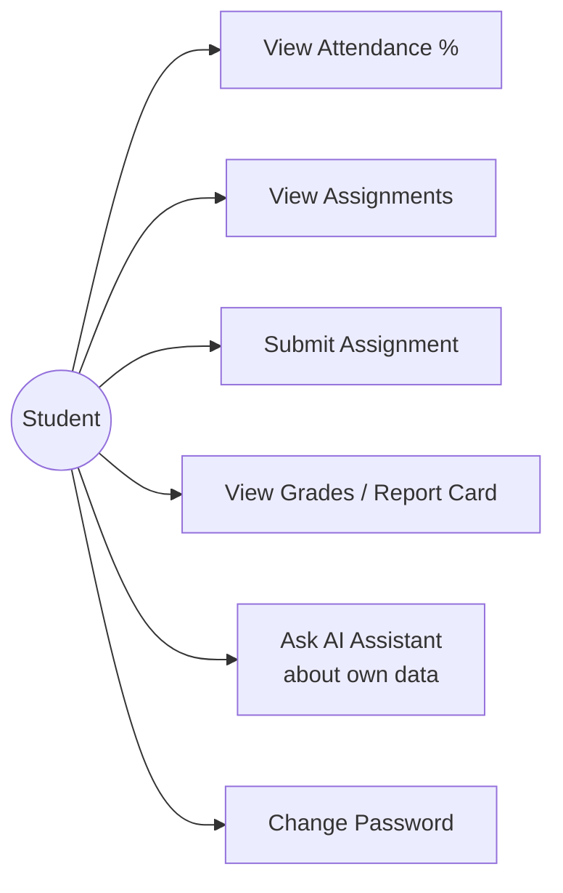
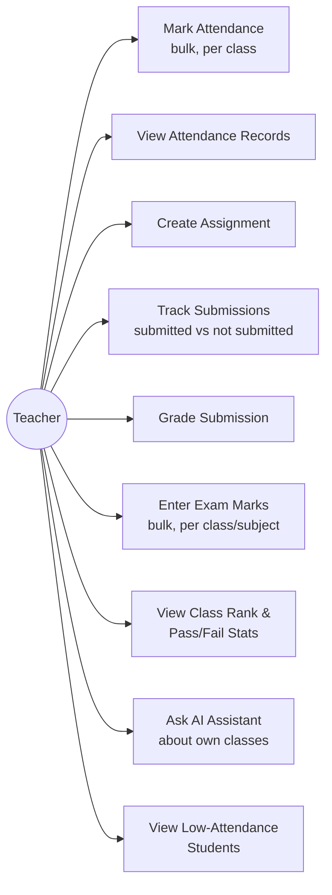
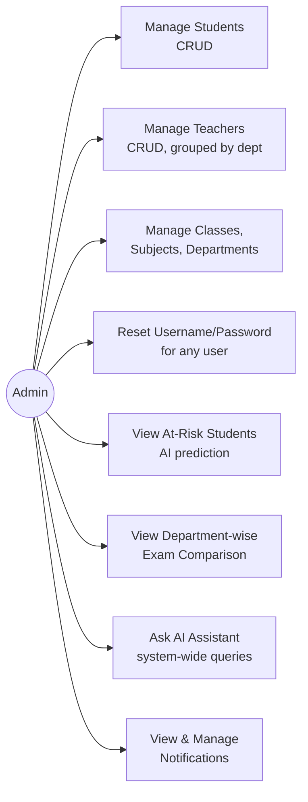
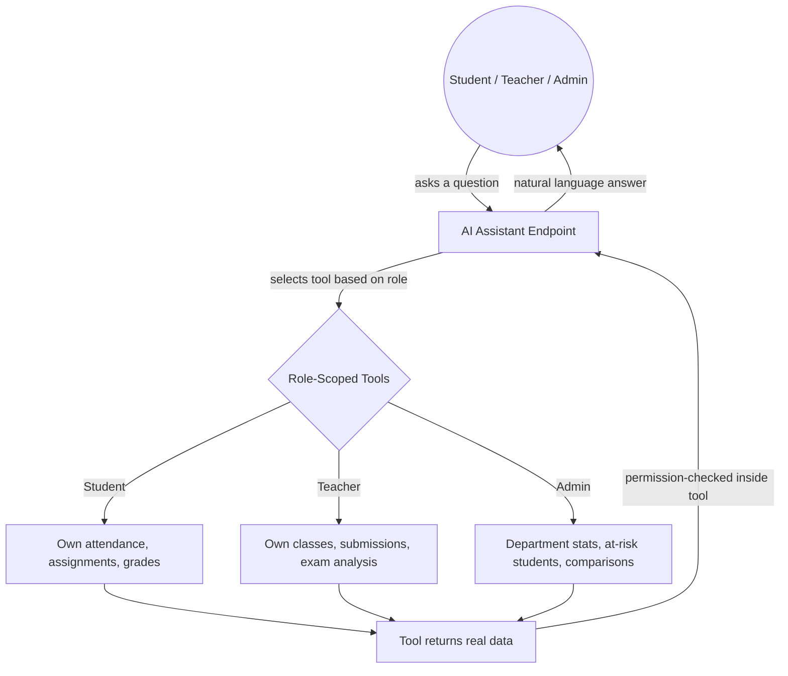

# AcademiQ — AI Student Management System

## Overview

**AcademiQ** is a web-based platform that digitizes and automates academic operations for educational institutions, combining traditional student management with three cooperating AI subsystems — predictive analytics, a role-scoped conversational assistant, and automated anomaly detection.

Many colleges still rely on manual registers, spreadsheets, and disconnected tools to manage students, attendance, assignments, and marks. AcademiQ centralizes these processes into a single system, and layers AI on top to surface insights that would otherwise require manual review — at-risk students, exam performance trends, and unusual attendance patterns — without replacing human decision-making.

Students are organized by **class groups (Department + Year)**, allowing teachers to distribute assignments, mark attendance, and enter exam scores for an entire class at once, similar to systems like Google Classroom.

---

## Problem Statement

Educational institutions often face:

- Attendance maintained in paper registers or disconnected spreadsheets
- Student records scattered across multiple tools
- No centralized system for assignments, submissions, and grading
- Limited or no early warning when a student starts struggling
- No easy way for staff to get quick answers about their own data without navigating multiple screens

---

## Solution

A centralized Django platform covering:

- Student, teacher, class, subject, and department management (full CRUD)
- Attendance tracking with bulk-mark support and historical record management
- Assignment distribution, student submission, and teacher grading — end to end
- A dedicated Marks module for exam-based scoring (Internal 1, Internal 2, Midterms, Finals, etc.), with automatic pass/fail, letter grades, and class rank
- Report cards combining attendance percentage, exam marks, and assignment grades
- REST API with JWT authentication and auto-generated Swagger/OpenAPI documentation
- **AI-based at-risk student prediction** using a trained scikit-learn model
- **A role-scoped conversational AI assistant** (student / teacher / admin) built on the Groq API with tool-calling
- **Automated anomaly detection and notifications** for attendance drops and missed academic activity

---

## What Makes This Different

Most student management tools that advertise "AI" ship a single chatbot bolted onto a CRUD app. AcademiQ instead runs **three distinct AI systems that cooperate**:

1. A trained ML model predicts which students are at risk based on real attendance/marks/submission behavior.
2. A conversational agent can *call* that risk model as one of its tools, alongside role-specific data lookups — but every tool independently re-checks permissions at the function level, so a student can never retrieve another student's data even through adversarial phrasing.
3. A rule-based anomaly watcher runs independently on a schedule and proactively surfaces problems (attendance crashes, unmarked classes, missed submission streaks) as notifications — nobody has to go looking for them.

AI limitations are documented honestly rather than overstated: the risk model's labels are rule-derived from attendance/marks thresholds, not from real historical outcome data, and this is stated plainly in `ai_engine/README.md`.

---

## System Architecture

```
Browser (Bootstrap 5 templates)
        ↕ session auth
Django backend  ←→  SQLite (dev) / PostgreSQL (prod-ready)
        ↕ JWT
DRF REST API  →  drf-spectacular Swagger UI
        ↕
┌──────────────────────────────────────────────┐
│  AI Layer                                    │
│  ai_engine/   → scikit-learn risk prediction │
│  assistant/   → Groq LLM + role-scoped tools │
│  notifications/ → rule-based anomaly checks  │
└──────────────────────────────────────────────┘
```

---

## Project Structure

```
academiQ/
│
├── backend/
│   └── college_ai/                 ← Django project root
│       ├── college_ai/             ← Settings, root urls, wsgi
│       ├── users/                  ← Teacher model, auth, permissions, credential mgmt
│       ├── students/               ← Student model, CRUD views
│       ├── academics/              ← Department, Subject, Class, Assignment,
│       │                             Submission, Mark, TeacherSubjectClass
│       ├── attendance/             ← Attendance model, bulk-mark, list/delete views
│       ├── ai_engine/              ← At-risk prediction (scikit-learn, joblib)
│       ├── assistant/              ← Groq-based conversational AI assistant
│       ├── notifications/          ← Anomaly detection + notification system
│       ├── templates/              ← All Django templates (Bootstrap 5)
│       │   ├── base.html
│       │   ├── auth/
│       │   ├── dashboard/
│       │   ├── academics/
│       │   ├── students/
│       │   └── notifications/
│       └── static/                 ← Project-level static files
│
├── requirements.txt
└── README.md
```

> **Note:** There is no top-level `frontend/` directory. All templates live inside `backend/college_ai/templates/` and are served directly by Django. `TEMPLATES['DIRS']` and `STATICFILES_DIRS` both point inside `backend/college_ai/`.

---

## Technology Stack

| Layer             | Technology                                                 |
| ----------------- | -----------------------------------------------------------|
| Backend           | Python 3.12, Django 5.x                                    |
| REST API          | Django REST Framework 3.16, drf-spectacular (Swagger)      |
| Auth              | Django session auth + JWT (djangorestframework-simplejwt)  |
| Frontend          | Django templates + Bootstrap 5 (CDN)                       |
| Database          | SQLite (dev), PostgreSQL (prod-ready)                      |
| ML / AI           | scikit-learn, pandas, numpy, joblib                        |
| Conversational AI | Groq API (`llama-3.3-70b-versatile`) with tool-calling     |

---

## Feature Breakdown

### Core Management
- Full CRUD for Students, Teachers, Classes, Subjects, Departments
- Teacher–Subject–Class linking to scope what each teacher can see/edit
- Admin-only credential management (reset username/password for any student or teacher, with audit logging and JWT invalidation on password change)

### Attendance
- Bulk attendance marking per class/subject/date
- Historical attendance list with filtering, and delete for corrections

### Assignments & Grading
- Teachers create assignments per class/subject
- Students upload submissions before the due date
- Teachers view submission status per assignment (submitted / not submitted) and grade individual submissions
- Grades are reflected on the student's own dashboard and visible to admins

### Marks Module
- Teachers record exam scores (Internal 1, Internal 2, Midterm, Final, etc.) in bulk per class/subject
- Automatic pass/fail threshold, letter grades, and class rank calculation
- Department-wise and class-wise marks views for admins and teachers

### AI: At-Risk Prediction (`ai_engine/`)
- RandomForestClassifier trained on attendance %, average marks, and submission behavior
- Exposed via `/api/ai/risk-scores/`, restricted to teachers/admins
- Displayed as a risk-flag section on teacher and admin dashboards
- Model limitations documented transparently in `ai_engine/README.md`

### AI: Conversational Assistant (`assistant/`)
- One shared endpoint (`/api/assistant/ask/`) with role-scoped tools:
  - **Students** can ask about their own attendance, assignments, and grades
  - **Teachers** can ask about their own classes' attendance, pending submissions, low-attendance students, and exam analysis
  - **Admins** can ask about department stats, at-risk students, class rosters, and cross-department exam comparisons
- Every tool independently enforces permission checks — never trusted to the LLM alone
- Floating chat widget available on all three dashboards

### AI: Anomaly Detection & Notifications (`notifications/`)
- Scheduled rule-based checks for: sharp attendance drops, low class-wide attendance, unmarked attendance streaks, and missed-submission streaks
- Notifications delivered to relevant teachers/admins only, with duplicate prevention
- In-dashboard notification bell with mark-as-read

---

## Use Case Diagrams

### Student



### Teacher



### Admin



### AI Assistant — Shared Flow




```bash
# Clone
git clone https://github.com/Dinesh8778/academiQ.git
cd academiQ

# Create and activate virtual environment
python -m venv venv
venv\Scripts\activate          # Windows
# source venv/bin/activate     # macOS/Linux

# Install dependencies
pip install -r requirements.txt

# Configure environment
cd backend/college_ai
cp .env.example .env
# Edit .env — set SECRET_KEY, DEBUG=True, ALLOWED_HOSTS=127.0.0.1,localhost,
# and GROQ_API_KEY (required for the AI assistant feature)

# Apply migrations
python manage.py migrate

# Create test users (admin + teacher + student)
python manage.py create_test_users

# (Optional) seed synthetic data and train the risk model
python manage.py seed_ai_data
python manage.py train_risk_model

# Run the server
python manage.py runserver
```

Open **http://127.0.0.1:8000/** — redirects to login or the correct role-based dashboard automatically.

### Default test credentials

| Username      | Password     | Role    |
| ------------- | ------------ | ------- |
| admin_test    | Admin@1234   | Admin   |
| teacher_test  | Teacher@1234 | Teacher |
| student_test  | Student@1234 | Student |

---

## Key URLs

| URL                                 | Description                                  |
| ------------------------------------ | --------------------------------------------|
| `/`                                  | Redirects to dashboard or login             |
| `/auth/login/`                       | Login page                                  |
| `/auth/dashboard/`                   | Role-based dashboard redirect               |
| `/manage/students/`                  | Student management (admin/teacher)          |
| `/manage/teachers/`                  | Teacher management, grouped by department   |
| `/manage/classes/`                   | Class management (admin)                    |
| `/manage/subjects/`                  | Subject management (admin)                  |
| `/manage/departments/`               | Department management (admin)               |
| `/manage/assignments/`               | Assignment management                       | 
| `/manage/attendance/`                | Attendance records list                     |
| `/manage/marks/`                     | Marks management and bulk entry             |
| `/teacher/attendance/mark/`          | Bulk attendance marking                     |
| `/teacher/assignments/<id>/submissions/` | Submission tracking + grading           |
| `/api/ai/risk-scores/`               | At-risk student predictions (teacher/admin) |
| `/api/assistant/ask/`                | Conversational AI assistant endpoint        |
| `/api/docs/`                         | Swagger UI (full REST API reference)        |
| `/admin/`                            | Django admin panel                          |

---

## Running Tests

```bash
cd backend/college_ai
python -m pytest tests/ -v
```

The suite covers permissions, bulk attendance, report card calculation, AI risk prediction, assistant role-isolation (including adversarial access attempts), anomaly detection rules, and notification duplicate-prevention.

---

## Future Enhancements

- Timetable management
- Fee management module
- Write-capable assistant actions with human-confirmation workflow (draft notices, draft reports)
- Docker containerization and CI/CD pipeline
- PostgreSQL production deployment guide

---

## License

This project is created for educational and academic purposes.
